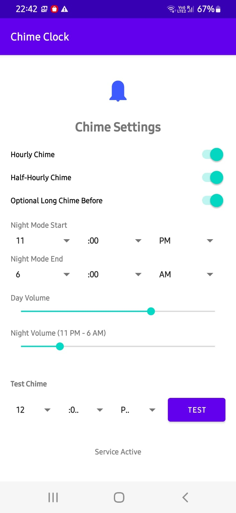

# 🔔 Chime Clock

A minimalist Android application that brings the classic charm of hourly and half-hourly chimes to your smartphone.

## ✨ Features

*   **Musical Chimes**: Custom-synthesized bell tones with rich harmonics.
    *   **Hourly**: A 5-note C Major Pentatonic sequence followed by an hour count.
    *   **Half-Hourly**: A reversed dual-tone sequence.
*   **Smart Night Mode**: Automatically lower the volume or silence chimes during your sleep hours with minute-precision scheduling.
*   **Dual Volume Control**: Independent sliders for Day and Night volume levels.
*   **Optional Long Chime**: Toggle a melodic sequence before the hourly strikes.
*   **Modern "No-Popup" UI**: A streamlined, single-screen interface using inline spinners instead of intrusive dialogs.
*   **Instant Testing**: A dedicated test section to preview chimes at any specific time.

## 🛠 Setup

1.  Open the project in **Android Studio**.
2.  Build and run on your device.
3.  **Note for Android 12+**: On first launch, the app will request "Exact Alarm" permission to ensure chimes trigger precisely on time.

## 🎵 Audio Details

The chimes are programmatically generated using additive synthesis to mimic the resonance of physical bells, including:
*   **Fundamental Tones**: Pure musical notes (C5 to C6).
*   **Harmonics**: Overtones for a rich, metallic "ring" and lingering release.
